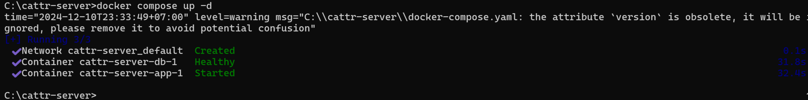

# Getting started :id=intro :priority=9
This article describes a simplified installation of the server part of cattr using Docker.

?>If you are a regular user, you don't need to do this, just [download client](en/?id=if-youre-an-employee) then enter the account information you received from the administrator.

## Minimal server side requirements  :id=requirements

### For basic installation

* OS:
 * Linux. __We recommend using Ubuntu version 22.04 and higher or Debian version 11 or higher__. 
 * Windows (10 or 11)
* RAM: at least 3Gb
* Storage: at least 10Gb of reserved disk space
* Docker: >= 20.10
* Docker Compose v2


For source development requirements, see [Advanced installation](en/advanced/).


## Linux installation Debian, Ubuntu :id=installation-linux-deb

?> For source development, see [Advanced installation](en/advanced/?id=intro).

### Install docker

#### For Ubuntu and Debian
Run the following commands in the terminal:

```bash
# Create non-root user with sudo privilages
adduser cattr
usermod -aG sudo cattr
# login into newly created user
# install docker 
sudo apt update
sudo apt install apt-transport-https ca-certificates curl software-properties-common
```

#### For Alt
Create a non-root User with extended privileges
To set up a non-root user with extended privileges, add the user to the `wheel` group. This group grants access to the `su -` command, allowing the user to execute commands with elevated rights.

Run the following commands as the `root` user. To switch to the root user, use `su -`.
```bash
apt-get update
/usr/sbin/adduser cattr
# Set a password for the new user
/usr/sbin/passwd cattr
# Add the user to the wheel group
/usr/sbin/usermod -aG wheel cattr
```

Install Docker and Docker Compose:
```bash
# Install Docker
apt-get install docker-engine
# Add the user to the docker group
/usr/sbin/usermod -aG docker cattr
# Start and enable the Docker service
systemctl enable --now docker
# Reboot the system
reboot
```
```bash
# Install Docker Compose
apt-get install docker-compose-v2
```
```bash
systemctl status docker # Check the Docker service status
docker info             # View information about the installed Docker
docker compose version  # Verify Docker Compose installation
```

#### For Ubuntu

```bash

curl -fsSL https://download.docker.com/linux/ubuntu/gpg | sudo gpg --dearmor -o /usr/share/keyrings/docker-archive-keyring.gpg
echo "deb [arch=$(dpkg --print-architecture) signed-by=/usr/share/keyrings/docker-archive-keyring.gpg] https://download.docker.com/linux/ubuntu $(lsb_release -cs) stable" | sudo tee /etc/apt/sources.list.d/docker.list > /dev/null
```

#### For Debian

```bash

curl -fsSL https://download.docker.com/linux/debian/gpg | sudo gpg --dearmor -o /usr/share/keyrings/docker-archive-keyring.gpg
echo "deb [arch=$(dpkg --print-architecture) signed-by=/usr/share/keyrings/docker-archive-keyring.gpg] https://download.docker.com/linux/debian $(lsb_release -cs) stable" | sudo tee /etc/apt/sources.list.d/docker.list > /dev/null
```

#### For Ubuntu и Debian

```bash

sudo apt update
apt-cache policy docker-ce # make shure docker will be installed from Docker repo instead of the default Ubutnu repo
sudo apt install docker-ce
sudo systemctl status docker # check status

# add user cattr to docker group
sudo usermod -aG docker cattr
su - cattr # apply changes
groups # check if group added
docker info # see info of installed docker

# install docker compose
mkdir -p ~/.docker/cli-plugins/
curl -SL https://github.com/docker/compose/releases/download/v2.30.3/docker-compose-linux-x86_64 -o ~/.docker/cli-plugins/docker-compose

chmod +x ~/.docker/cli-plugins/docker-compose
docker compose version # verify installation
```

#### For Ubuntu, Debian и Alt

```bash
# create directory for cattr server application and enter it
su cattr
cd /home/cattr
mkdir cattr-app
cd cattr-app
```

Next, you should select the option of installing using https (for the case when cattr will be used for work) or http (if cattr is used only for testing, or in a cluster installation, when this functionality is taken over by the cluster binding ingress/api gateway).

### HTTP only setup, see HTTPS below  
Create a .env file beside docker-compose.yml. Generate a unique application key with openssl rand -base64 32 and put its output after the base64: prefix in APP_KEY. Generate a separate password for each of DB_PASSWORD, DB_ROOT_PASSWORD, and APP_ADMIN_PASSWORD; openssl rand -hex 32 creates values that can be pasted directly into this file. Do not commit or share .env. Set APP_URL to the address users will open; use an https URL for the HTTPS setup.

~~~dotenv
APP_URL=http://your-server.example.com
APP_KEY=base64:REPLACE_WITH_RANDOM_KEY
DB_PASSWORD=REPLACE_WITH_RANDOM_PASSWORD
DB_ROOT_PASSWORD=REPLACE_WITH_ANOTHER_RANDOM_PASSWORD
APP_ADMIN_EMAIL=admin@example.com
APP_ADMIN_PASSWORD=REPLACE_WITH_RANDOM_PASSWORD
APP_ADMIN_NAME=Admin
~~~

Create a `docker-compose.yml` file with the following content:
~~~yaml
services:
  app:
    image: ghcr.io/cattr-app/server:latest
    restart: unless-stopped
    ports:
      - "80:8080"
    depends_on:
      db:
        condition: service_healthy
    volumes:
      - backend_storage:/opt/cattr/app/storage
    environment:
      APP_URL: "${APP_URL:?Set APP_URL in .env}"
      APP_ENV: production
      APP_DEBUG: "false"
      APP_KEY: "${APP_KEY:?Set APP_KEY in .env}"
      DB_CONNECTION: mysql
      DB_HOST: db
      DB_PORT: "3306"
      DB_DATABASE: cattr
      DB_USERNAME: cattr
      DB_PASSWORD: "${DB_PASSWORD:?Set DB_PASSWORD in .env}"
      APP_ADMIN_EMAIL: "${APP_ADMIN_EMAIL:?Set APP_ADMIN_EMAIL in .env}"
      APP_ADMIN_PASSWORD: "${APP_ADMIN_PASSWORD:?Set APP_ADMIN_PASSWORD in .env}"
      APP_ADMIN_NAME: "${APP_ADMIN_NAME:-Admin}"

  db:
    image: docker.io/percona:8.0
    restart: unless-stopped
    environment:
      MYSQL_DATABASE: cattr
      MYSQL_USER: cattr
      MYSQL_PASSWORD: "${DB_PASSWORD:?Set DB_PASSWORD in .env}"
      MYSQL_ROOT_PASSWORD: "${DB_ROOT_PASSWORD:?Set DB_ROOT_PASSWORD in .env}"
    cap_add:
      - SYS_NICE
    volumes:
      - database:/var/lib/mysql
    healthcheck:
      test: ['CMD', 'mysqladmin', 'ping', '-h', 'localhost']
      timeout: 20s
      retries: 10

volumes:
  backend_storage:
  database:
~~~

### HTTPS setup

If you wish to use custom domain. You need to install and setup nginx with proper ssl certificates.

You can setup nginx by youself or create the following `docker-compose.yml`:

~~~yaml
services:
  app:
    image: ghcr.io/cattr-app/server:latest
    restart: unless-stopped
    expose:
      - "8080"
    depends_on:
      db:
        condition: service_healthy
    volumes:
      - backend_storage:/opt/cattr/app/storage
    environment:
      APP_URL: "${APP_URL:?Set APP_URL in .env}"
      APP_ENV: production
      APP_DEBUG: "false"
      APP_KEY: "${APP_KEY:?Set APP_KEY in .env}"
      DB_CONNECTION: mysql
      DB_HOST: db
      DB_PORT: "3306"
      DB_DATABASE: cattr
      DB_USERNAME: cattr
      DB_PASSWORD: "${DB_PASSWORD:?Set DB_PASSWORD in .env}"
      APP_ADMIN_EMAIL: "${APP_ADMIN_EMAIL:?Set APP_ADMIN_EMAIL in .env}"
      APP_ADMIN_PASSWORD: "${APP_ADMIN_PASSWORD:?Set APP_ADMIN_PASSWORD in .env}"
      APP_ADMIN_NAME: "${APP_ADMIN_NAME:-Admin}"

  db:
    image: docker.io/percona:8.0
    restart: unless-stopped
    environment:
      MYSQL_DATABASE: cattr
      MYSQL_USER: cattr
      MYSQL_PASSWORD: "${DB_PASSWORD:?Set DB_PASSWORD in .env}"
      MYSQL_ROOT_PASSWORD: "${DB_ROOT_PASSWORD:?Set DB_ROOT_PASSWORD in .env}"
    cap_add:
      - SYS_NICE
    volumes:
      - database:/var/lib/mysql
    healthcheck:
      test: ['CMD', 'mysqladmin', 'ping', '-h', 'localhost']
      timeout: 20s
      retries: 10

  webserver:
    image: nginx:alpine
    container_name: webserver
    restart: unless-stopped
    ports:
      - "80:80"
      - "443:443"
    volumes:
      - ./nginx/conf.d/:/etc/nginx/conf.d/:ro
      - ./nginx/certs:/etc/nginx/certs:ro

volumes:
  backend_storage:
  database:
~~~

Create `nginx/conf.d` and `nginx/certs` directories for a nginx service


```bash
mkdir -p nginx/conf.d nginx/certs
```

Create a `nginx.conf` file in the `nginx/conf.d` directory and put below content in it:

```nginx
map $http_upgrade $connection_upgrade {
    default upgrade;
    ''      close;
}
server {
    listen 80 default_server;
    listen [::]:80 default_server;

    location / {
      # change domain for redirect
        return 301 https://your-domain.example.com$request_uri;
    }
}
server {
    listen 443 ssl;
    listen [::]:443 ssl;
    http2 on;
    # change domain
    server_name your-domain.example.com;
    # use correct path for certs
    ssl_certificate /etc/nginx/certs/fullchain.pem;
    ssl_certificate_key /etc/nginx/certs/privkey.pem;

    location / {
        proxy_set_header X-Real-IP  $remote_addr;
        proxy_set_header X-Forwarded-For $proxy_add_x_forwarded_for;
        proxy_set_header Host $host;
        proxy_set_header X-Real-Port $server_port;
        proxy_set_header Upgrade $http_upgrade;
        proxy_set_header Connection $connection_upgrade;

        proxy_set_header X-Forwarded-Proto $scheme;
        proxy_pass http://app:8080;
    }
}
```

Place your certificate and key at nginx/certs/fullchain.pem and nginx/certs/privkey.pem.

Application files and database contents are stored in named Docker volumes, so separate host directories and ownership changes are not required.

### Launching the app
Now you can launch the app with `docker compose up -d` command in the folder where the docker-compose.yml file is located, the first launch can take several minutes while the database initializes.


## Windows Installation  :id=installation-windows

### Docker installation

Download and install Docker Desktop from the [official site](https://www.docker.com/).


For Docker to work in Windows you may need to enable virtualization in BIOS and [install WSL 2](https://learn.microsoft.com/en-us/windows/wsl/install). The installation process is described in details [in the Docker user manual](https://docs.docker.com/desktop/setup/install/windows-install/).


### Preparing to start Cattr server


Create folders manually or run the following command in the cmd or PowerShelll:

```bash
cd c:\
mkdir cattr-server
cd cattr-server

```

Create a .env file in this folder using the variables above, and set APP_URL to http://localhost for local access. Then create the Compose file:

Create a `docker-compose.yml` file in the c:\cattr-server\ folder with the following contents:

~~~yaml
services:
  app:
    image: ghcr.io/cattr-app/server:latest
    restart: unless-stopped
    ports:
      - "80:8080"
    depends_on:
      db:
        condition: service_healthy
    volumes:
      - backend_storage:/opt/cattr/app/storage
    environment:
      APP_URL: "${APP_URL:?Set APP_URL in .env}"
      APP_ENV: production
      APP_DEBUG: "false"
      APP_KEY: "${APP_KEY:?Set APP_KEY in .env}"
      DB_CONNECTION: mysql
      DB_HOST: db
      DB_PORT: "3306"
      DB_DATABASE: cattr
      DB_USERNAME: cattr
      DB_PASSWORD: "${DB_PASSWORD:?Set DB_PASSWORD in .env}"
      APP_ADMIN_EMAIL: "${APP_ADMIN_EMAIL:?Set APP_ADMIN_EMAIL in .env}"
      APP_ADMIN_PASSWORD: "${APP_ADMIN_PASSWORD:?Set APP_ADMIN_PASSWORD in .env}"
      APP_ADMIN_NAME: "${APP_ADMIN_NAME:-Admin}"

  db:
    image: docker.io/percona:8.0
    restart: unless-stopped
    environment:
      MYSQL_DATABASE: cattr
      MYSQL_USER: cattr
      MYSQL_PASSWORD: "${DB_PASSWORD:?Set DB_PASSWORD in .env}"
      MYSQL_ROOT_PASSWORD: "${DB_ROOT_PASSWORD:?Set DB_ROOT_PASSWORD in .env}"
    cap_add:
      - SYS_NICE
    volumes:
      - database:/var/lib/mysql
    healthcheck:
      test: ['CMD', 'mysqladmin', 'ping', '-h', 'localhost']
      timeout: 20s
      retries: 10

volumes:
  backend_storage:
  database:
~~~
The initial administrator account uses APP_ADMIN_EMAIL and APP_ADMIN_PASSWORD from .env.

### Start the cattr server application 

Now, located in the c:\cattr-server folder, run the application with the command 

```bash
docker compose up -d

```



 The first startup can take several minutes while the database initializes. Check the service status in Docker Desktop or with docker compose ps.

Once the application run, the cattr server will start responding to http://localhost.

Sign in with the administrator email and password set in .env.


?>If something went wrong - [Debug and possible errors](ru/getting-started/?id=debug-and-errors)


### Debug :id=debug-and-errors

To see logs run `docker compose logs -f`  
!> If you have waited for several minutes and it seems like the process froze on db side, run `docker compose down` and than launch it again with `docker compose up -d`


!> Wait untill all database migrations are completed


Finally you should see the following message at the end "Server running" and be able to access Cattr by http or https protocol which depends on the chosen installation method, for example with http installation if your server’s ip is 0.0.0.0 go to http://0.0.0.0 or with https visit your domain, for example https://cattr.app 


## Common errors list  :id=errors

<details>
<summary>
docker: Cannot connect to the Docker daemon at unix:///var/run/docker.sock. Is the docker daemon running?
</summary>

**Make sure Docker is installed on the server you're trying to launch Cattr, and execute the command one more time**
</details>

<details>
<summary>
Error starting userland proxy: listen tcp 0.0.0.0:80 bind: address already in use.
</summary>

**Make sure Cattr is not running already, and there is no other web services installed on the server you're trying to launch Cattr on. We would suggest you consulting your system administrator for that matter.**
</details>

?> If you bumped into error that wasn't described above, feel free to ask a question in our [Github Discussions](https://github.com/orgs/cattr-app/discussions).

## What's next?  :id=next

After you finish installing, you will be able to login with the credentials you provided for Administrator user. Once you log in, you'll be able to create projects, tasks, and assign them to the new users.

?>You can read about how to do it all in [Create project](en/workflow/?id=project), [Create task](en/workflow/?id=task) and [Create user](en/users/?id=create) sections.
