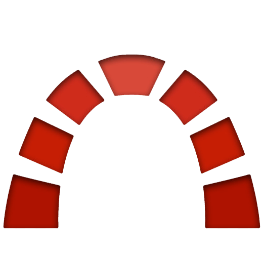
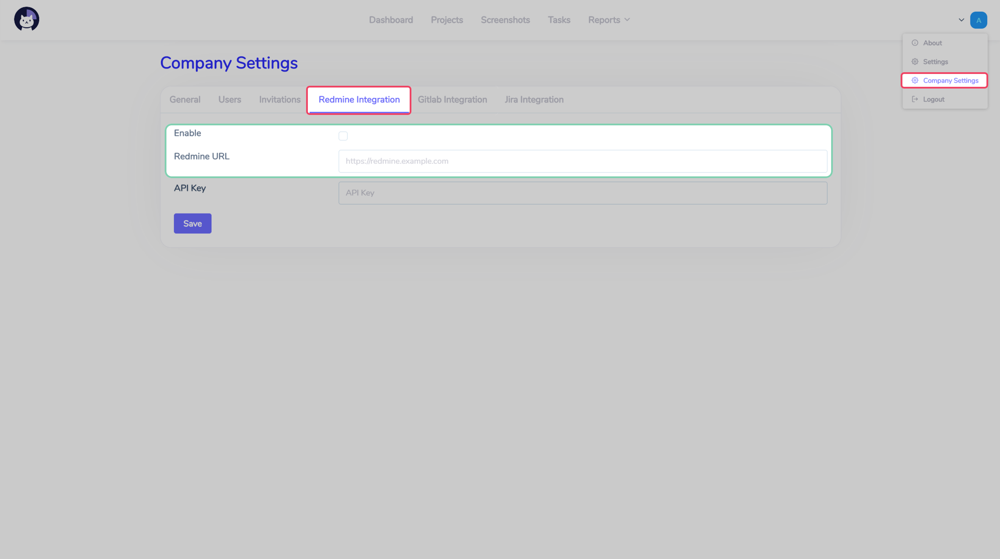
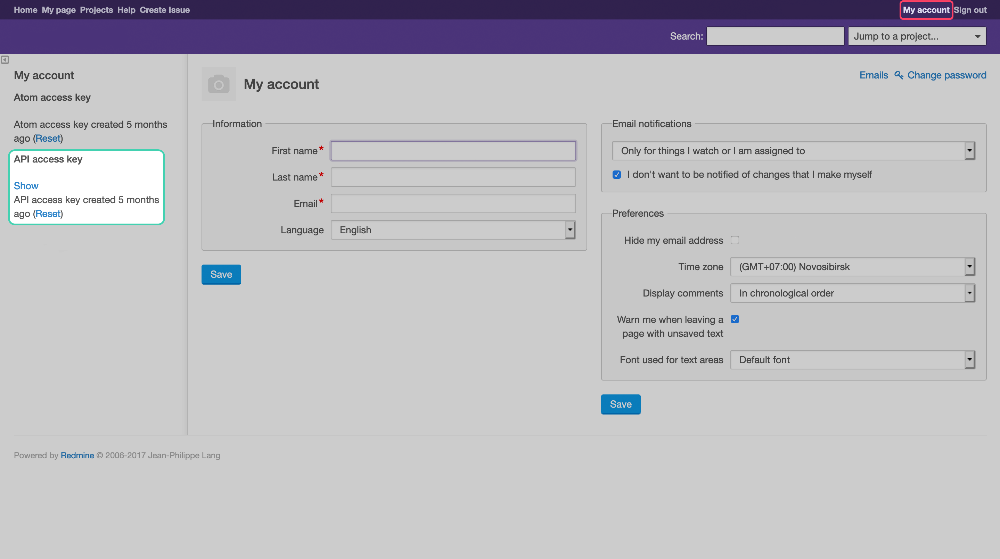

# Integrations  :id=intro

Cattr's integrations provides more abilities for the system, automotizes some of the Cattr's actions, and integrate the service to the existing workflow.

## Redmine  :id=redmine

Redmine integration lets you synchronize the tasks and projects, created both in it, and in Cattr.

### Global settings  :id=redmine-global

To turn on/off the Redmine sync, change the according setting on the `Company settings`'s `General` section.

Once you enable the integration, you'll see an additional tab on the `Company settings` page, called `Redmine`, which will let you add all the necessary settings.

_TODO ОПИСАНИЕ НАСТРОЕК_

### User settings  :id=redmine-personal

If the sync is turned on for the company, then every user will have to add the personal key which will be used by Cattr. You can get the necessary key on the `My account`'s Redmine page. 

You'll need to add this key to the according field on `Settings`'s `Redmine Integration` section.

### I've created a task in Redmine, but can't find it in Cattr  :id=redmine-sync

Cattr опрашивает систему управления проектов с определенными интервалами, потому информация обновляется не сразу.

Cattr sends requests to redmine on a time base, which is why you can not see it just after you create it.

- Tasks are synced every __1 min__
- Projects are synced every __5 mins__
- Users are synced every __5 mins__
- Time spent is synced every __5 mins__
- Priorities are synced every __15 mins__

### I've removed a task in Catt, but it's still available in Redmine  :id=redmine-delete

Cattr integration doesn't remove tasks from Redmine. You'll need to remove it there manually.
