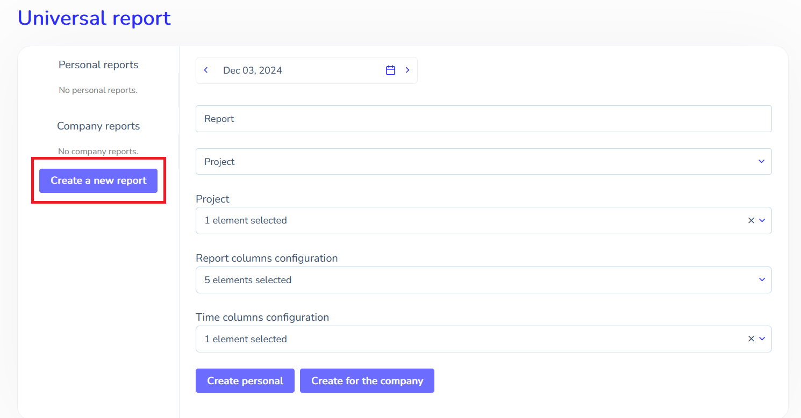
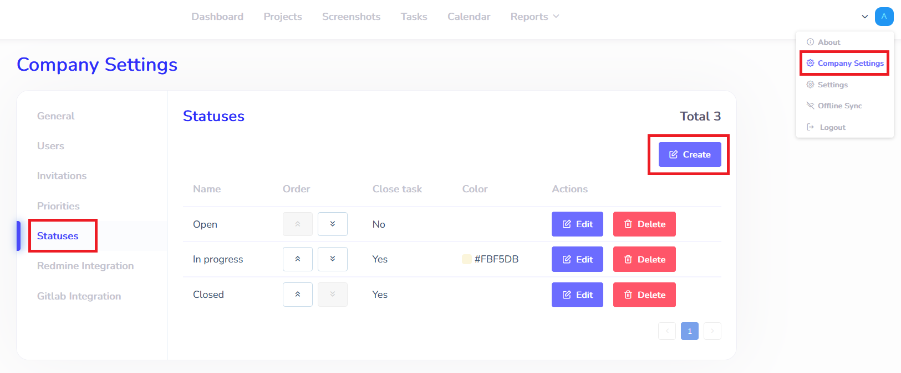
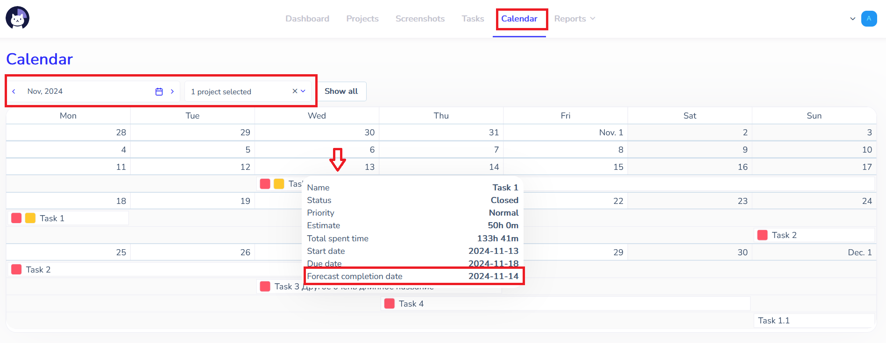

# Reports  :id=intro :priority=7

Cattr lets you generate different reports to control the company's time use

## Who's working right now  :id=online

To check the current activity you can use Team dashboard. It's available on `Dashboard` page's `Team` section.

!> To access this feature your account should have `manager` or `auditor` role.

You can see who's working right now in the `Active` section. If the user's working at the moment, there'll be a task's name above the user's one. That's the task the user's working right now.

## Time spent  :id=project

To see the projects' time spent, go to the `Projects report` section. It's grouped alongside with the `Time use report` one in the `Reports` tab.

!> This feature is available for all users, but reports with multiple ones is only available for users with `manager` or `auditor` role

You can filter reports by date (date range), users and projects. If you click the user's name, you'll see a task list with their time spent under the project. If you click the task name and then select the date range, you'll see the screenshots that've been made when the user was working on the task.

If there are multiple tasks or users in each project, the progress bars will display what took the most part in the work on task and/or project.

?> You can save the report to your computer in the necessary format

## Time use  :id=use

You can get the time the user spent in the according interval in the `Time use report` section. It's grouped alongside with the `Projects report` one in the `Reports` tab.

!> This feature is available for all users, but reports with multiple ones is only available for users with `manager` or `auditor` role

If you select the user, you can see the tasks (and the tasks' projects), the user has been working on, and the time use's comparison for them.

## Planned Time Report  :id=planned

This report is calculated once a day at 00:00:00 of the selected date in the company's time zone. It shows the planned and worked time of specific employees on selected projects and tasks, as well as the productivity of task completion, calculated as the ratio of worked time to planned time. Tasks in the report are sorted by projects and within them - by actual time worked on tasks in descending order. One mouse click (in the desktop version) or tap (in the mobile version) on a task will open the list of performers with the actual time worked on the task. Productivity is specified only for a task and is not displayed in the list of its executors.

?> Tasks in the report can have a red ‘Overdue’ tag (if the task completion date is longer than scheduled) and an orange ‘Overtime’ tag (if the task completion time is longer than planned).

## Universal Report  :id=universal

?> This type of report allows you to customise specific fields and columns for quick access to the required data. It can be created both for a company (in this case it can be generated by all users with the appropriate access) and for a specific user.

Data can be sorted by:
* projects - the report displays total work time of all users and work time of each user individually on selected projects, tasks are ‘embedded’ in a project and are opened when clicking on them;

* users - the report displays the total time of a user on selected projects, projects are ‘embedded’ into a user and are opened by clicking on it;

* tasks - the report displays the total time of all users and the time of each user separately on selected tasks, users are ‘embedded’ into tasks and are opened by clicking on them.

An example of creating a universal report on a project: select the required report parameters, click `Save`, then `Form'.

 
Also this report type includes charts, these are displayed on the frontend when the report is generated, and also when the report is downloaded in Excel format.

## Gantt chart :id=gant

To view a project as a Gantt chart, go to the `Projects` menu item and select the appropriate option from the project list:

?> A Gantt chart is a project visualisation tool that shows a project as a sequence of related tasks over time. It is a chart-table with a list of tasks on the vertical axis and a timeline on the horizontal axis, on which the stages and tasks of the project are marked. When you hover over a task, a pop-up window with general information about it appears.

The red vertical bar marks today's date.  Before the red line there are tasks whose planned completion date has already passed. If a task is overdue (completed later than planned), then the productivity value calculated as the ratio of time worked to the planned time will be indicated inside the task (if it is greater than 100, the task is overdue).

## Kanban :id=kanban

To view a project in the kanban board, go to the `Projects` menu item and select the appropriate option from the projects list:

?> The kanban board is a project visualisation tool that shows the project in the form of several columns (corresponding to the workflow, e.g. the ‘To Do’, ‘In Progress’ and ‘Completed’ columns).

Each column is a status set by the administrator in the Statuses section of the Company Settings:

.

When creating a Status (kanban column), you should specify its name, background colour of the column header and, using the ‘Close task’ checkbox - whether the task should be closed after receiving this status (moving to this kanban column).

Each task is designed as a card, which in the process moves between columns according to its stage.

When you click/tap on a task card, a window containing basic information about the task and buttons for viewing, editing or deleting the task appears. To move a task card to another column in the mobile version, press the purple circle at the bottom of the card and pull it to the column you need.

## Calendar :id=calender

The `Calendar` tab displays the tasks of the selected month in the form of a planner.

Tasks that are 00:00:00:00 today (in the company time zone) have a red ‘Overdue’ tag (if the task due date is longer than planned) and/or an orange ‘Overtime’ tag (if the task due date is longer than planned- see «[Planned time](/ru/reports/?id=planned)»), have corresponding colour indicators in the Calendar.

When hovering over a task, a pop-up window with general information on the task appears, as well as, for individual tasks and executors, **Forecast Completion Date**. It allows you to predict the actual completion date of the task, taking into account the personal efficiency of the task's executor(s).

The forecast completion date is calculated as follows:

* if no executor has been assigned to the task, or the task has not been completed, or the executor has not yet completed any tasks in the last 2 months, the Forecast Completion Date is not calculated.

* if the task has one executor, the **employee efficiency coefficient** (hereinafter referred to as EEC) for the last 2 months is taken and multiplied by the scheduled time. Example: Employee's EEC is 1.5, task completion time planned is 10 hours. The forecast completion date is 1.5*10=15 hours.
 
* if a task is performed by several users, the arithmetic average of their EEC is taken.
?> The EEC for all employees is recalculated once a day by cron. The displayed data is current as of 00:00:00 of today (in the company's time zone).

**The EEC is the ratio of the actual task completion time to the planned one.
If an employee has already performed a task in the last two months, his/her EEC = sum of EEC of all his/her tasks for the last 2 months/number of tasks for the last 2 months.

?"> Example:
A user has completed 3 tasks in the last 2 months: one in 150 hours with an estimate of 50 hours (EEC  =3), the second in 100 hours with an estimate of 80 hours (EEC  = 1.25) and the third in 2 hours with an estimate of 20 hours (EEC =0.2). User's EEC = (3+1,25+0,2)/3=1,48.

!> Important: The calculation of Forecast Completion Date involves the actual performers of the task. If a user has been removed from the list of executors, his EEC is not taken into account.
