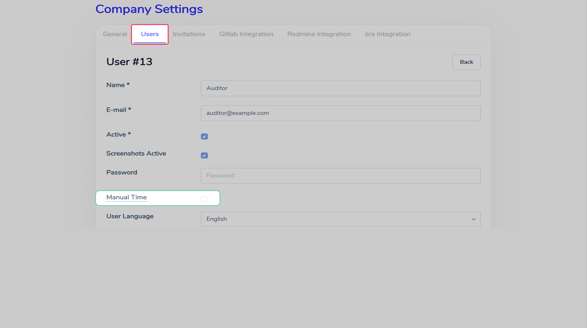

# Access roles  :id=intro :priority=7

!> In order to make any changes for users' roles, your account has to have a `root` role.

User's access to Cattr's sections is determined by assigning and removing roles.

## Existing roles  :id=existing

Right now, the available roles are:
- `root` - has access to all sections
- `manager` - can view, create and edit users; view, create, edit and remove projects and tasks
- `auditor` - can view all the users, all the projects and tasks; create tasks
- `user` - can create time intervals and screeenshots; view the assigned tasks

The first user created with the Cattr's installation process has `root` role.

## Assigning roles  :id=promote

You can change the user's role both for the whole organization (which will make its role as a default for new projects the user will be assigned to), and for a specific project. To change the roles for the user, go to `Company settings` page's `Users` section, and select the user you'd like to make changes for.

To change the user's role for the particular project, you'll need to select the project in the dropdown project search field, and the necessary role.

## Manual time addition  :id=manual-time

?> Working with manual time addition is described in [Manual time addition](en/workflow/?id=manual-time) section

To turn on/off the manual time addition functionality for the user, go to `Company settings` page  to the `Users` section, and select the user you'd like to make changes for.

To enabble the manual timme addition functionality for a user, you'll need to change the according settings in the user's profile.

 
