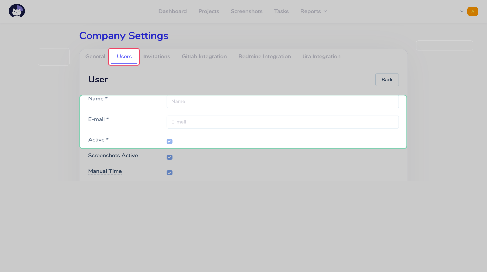

# Users  :id=intro :priority=7

!> In order to change anything about company's users, your account should have the `root` role.

On page `Settings` Each user is able to chane its email, displayed name, password and app's language.

Users list is available on the `Company settings` page in `Users` section.

## Create user  :id=create

You can create a new user on the `Company settings` page in `Users` section.

Once you're done adding username, email and password, click `Save`, and the user will be created.

---

- `Default role` sets the default user's role for the projects (excluding those projects where this particular user's role is overridden)
- `Screenshots interval` defines how many seconds is going to go before the client application create a new screenshot
- `Computer time popup` defines how many seconds will the user have before the work timer is stopped once the user's inactivity (no mouse moves or any key presses) is detected
- `Timezone` defines the user's timezone
- If you set the `Send invite` param as `Yes`, the user's Cattr account credentials will be sent to the user's email
- `Manual time` param is described on the [Manual time addition](ru/roles/?id=manual-time) page

?> You can learn more about the user's roles on the [Access roles](en/roles/) page

## Password reset  :id=reset

If you forget your password, it's possible to reset the password on the login page.

On the reset password page you'll need to provide the email for the account you're resetting the password for.

Once you do that, you'll receive an email with the link to reset the password.

## Timezone  :id=timezone

It's possible to set the timezone both for company and for the user separately. Company's timezone is used for generating and displaying the reports, and it's the same timezone for users who haven't overridden it in their settings.

If the user will have the timezone overridden, the reports will have the according timezone amendments for this user's time.
