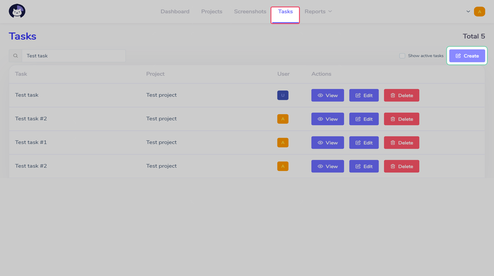

# Workflow  :id=intro

Work with Cattr can be described in the following sections.

## Create project  :id=project

Projects contains and groups task inside them, which makes it easier to make the according reports and to control access to the related tasks.

!> Projects can only be created by users who have role `manager`

To create a new project, go to the `Projects` section and click `Create`.

Once you add the project's name and description, click `Save`.

?> `Important` option lets you save the project's screenshots when cleaning up the storage if the server runs out of space

Once the project is created, you can create tasks for it, and assign user for those.

?> You can lear how to assign managers for the projects, who are able to create and assign tasks in [Roles](en/roles/?id=promote) section

## Create task  :id=task

Tasks are belong to projects and they're used to create time intervals that are tracked by Cattr.

!> Tasks can only be created by users who have role `manager` or `auditor`

To create a new task go to the `Tasks` section and click `Create`.

Once you add the task's name, description and priority, you'll be able to select a task's project from the dropdown menu. The project's name field will dynamically suggest you the found projects. After that, you can assign the user to the task and save it, clicking `Save`.

?> `Important` option lets you save the task's screenshots when cleaning up the storage if the server runs out of space

Once the task is added, the assigned user will be able to track the task's time.

?> Projects and tasks can be created automatically, if you add one of the [integrations](en/integrations/) to Cattr

## Client application  :id=tracker

In order to go through authorization process you'll need to use your Cattr instance's hostname, and user account's email and password.

Once you log in, you'll see the task list that are assigned to you, and how much time you've worked today.

If you click the task's name, you'll see its description. To start tracking time, you have to click the time button, located next to the task. In order to stop tracking time, you can click the time button next to the current task, or click the main time tracking button which is located in the client window's bottom part.

## Manual time addition  :id=manual-time

Users can add time spent both with the client app and control panel.

!> By default users can't manually add time via control panel. You can learn more about it on the [Access rules](en/roles/?id=manual-time) page

To add the time spent you'll need to go to the page `Dashboard` and select the `Add time` section.

Once you add the user, task, and time interval borders, click `Save`.

?> Manually created time intervals will be shown in a different color on page `Dashboard` in sections `Personal` and `Team`.
 

