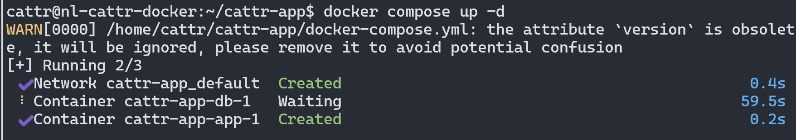
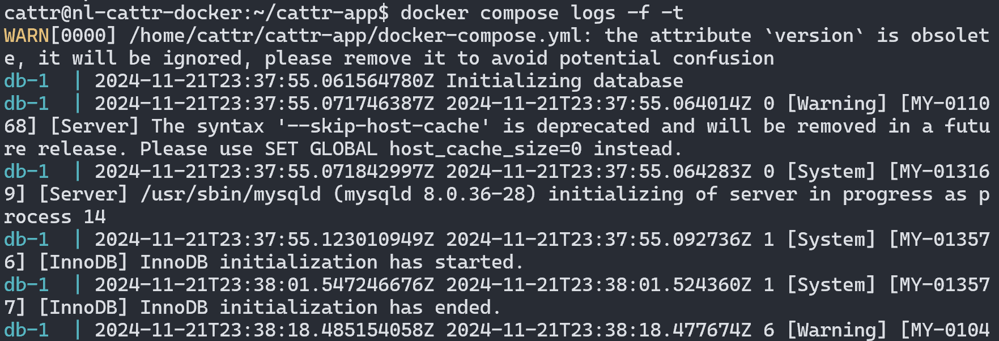

# Начало работы  :id=intro :priority=9
Эта глава описывает установку приложения с использованием Docker для контейнеризации приложения.

## Минимальные требования  :id=requirements
* RAM: не менее 3Гб
* Storage: не менее 10Гб зарезервированного свободного места
* Docker: >= 20.10
* Docker compose: >= 2.3.4
* Для Linux: Ubuntu: LTS 22.04
* Для Windows: Windows 10 или Windows 11

## Установка  :id=installation

?> Если у вас достаточно опыта, то вы можете произвести [установку](ru/advanced/?id=intro) без докера (только в linux)

### Установка docker

#### Windows

Скачайте и установите Docker Desktop с [официального сайта](https://www.docker.com/).


Для работы Docker в Windows вам может потребоваться включить виртуализацию в BIOS и [установить WSL 2](https://learn.microsoft.com/ru-ru/windows/wsl/install). Подробно процесс установки описан [в руководстве пользователя Docker](https://docs.docker.com/desktop/setup/install/windows-install/).

#### Linux

Выполните в терминале следующие команды:

```bash
# Создайте не root пользователя с правами sudo
adduser cattr
usermod -aG sudo cattr
exit
# Залогиньтесь в новосозданного юзера
# установите docker 
sudo apt update
sudo apt install apt-transport-https ca-certificates curl software-properties-common

curl -fsSL https://download.docker.com/linux/ubuntu/gpg | sudo gpg --dearmor -o /usr/share/keyrings/docker-archive-keyring.gpg
echo "deb [arch=$(dpkg --print-architecture) signed-by=/usr/share/keyrings/docker-archive-keyring.gpg] https://download.docker.com/linux/ubuntu $(lsb_release -cs) stable" | sudo tee /etc/apt/sources.list.d/docker.list > /dev/null

sudo apt update
apt-cache policy docker-ce # убедитель что docker будет установлен из Docker репозитория вместо стандартного репозитория Ubuntu
sudo apt install docker-ce
sudo systemctl status docker # проверьте статус

# добавьте пользователся в docker группу
sudo usermod -aG docker ${USER}
su - ${USER} # примените изменения
groups # проверьте что группа добавлена
docker info # посмотрите информацию об установленном docker

# установите docker compose
mkdir -p ~/.docker/cli-plugins/
curl -SL https://github.com/docker/compose/releases/download/v2.30.3/docker-compose-linux-x86_64 -o ~/.docker/cli-plugins/docker-compose

chmod +x ~/.docker/cli-plugins/docker-compose
docker compose version # проверьте установку

# создайте директорию для серверного приложения Кэттр
cd /home/cattr
mkdir cattr-app
```

### Только HTTP установка, смотрите HTTPS ниже  

Создайте файл `docker-compose.yml` со следующим содержимым:

```yaml
version: '3.9'

services:
  app:
    image: registry.git.amazingcat.net/cattr/core/app:0-grant
    restart: unless-stopped
    ports:
      - "80:80"
    depends_on:
      db:
        condition: service_healthy
    volumes:
      - ./storage:/app/storage
    networks:
       - default
#      - web
    environment:
      - DB_USERNAME=root
      - DB_PASSWORD=bP8T109h6BuL
      - APP_KEY=base64:lg1m/12MHBbBpiWTXjot98Q9MP/nSzPrvLEU2beD+2Y=
      # Изначальный Admin пользователь будет создан только при первом запуске, вы можете изменить его данные если необходимо
      - APP_ADMIN_EMAIL=admin@cattr.app
      - APP_ADMIN_PASSWORD=password
      - APP_ADMIN_NAME=Admin

  db:
    image: percona:8.0
    restart: unless-stopped
    environment:
      - MYSQL_DATABASE=cattr
      - MYSQL_ROOT_PASSWORD=bP8T109h6BuL
    cap_add:
      - SYS_NICE
    volumes:
      - ./data:/var/lib/mysql
    healthcheck:
      test: ['CMD', 'mysqladmin', 'ping', '-h', 'localhost', '--password=bP8T109h6BuL', '-u', 'root']
      timeout: 20s
      retries: 10
```

### HTTPS установка

Если вы хотите использовать собственный домен. Вам нужно установить nginx и подключить ssl сертификаты.

Вы можете установить nginx сами или создать следующий `docker-compose.yml`:

```yaml
version: '3.9'
services:
  app:
    image: registry.git.amazingcat.net/cattr/core/app:0-grant
    restart: unless-stopped
    depends_on:
      db:
        condition: service_healthy
    volumes:
      - ./storage:/app/storage
    networks:
      - default
    environment:
      - DB_USERNAME=root
      - DB_PASSWORD=bP8T109h6BuL
      - APP_KEY=base64:lg1m/12MHBbBpiWTXjot98Q9MP/nSzPrvLEU2beD+2Y=
      # Изначальный Admin пользователь будет создан только при первом запуске, вы можете изменить его данные если необходимо
      - APP_ADMIN_EMAIL=admin@cattr.app
      - APP_ADMIN_PASSWORD=password
      - APP_ADMIN_NAME=Admin

  db:
    image: percona:8.0
    restart: unless-stopped
    environment:
      - MYSQL_DATABASE=cattr
      - MYSQL_ROOT_PASSWORD=bP8T109h6BuL
    cap_add:
      - SYS_NICE
    volumes:
      - ./data:/var/lib/mysql
    healthcheck:
      test: ['CMD', 'mysqladmin', 'ping', '-h', 'localhost', '--password=bP8T109h6BuL', '-u', 'root']
      timeout: 20s
      retries: 10


#Nginx Service
  webserver:
    image: nginx:alpine
    container_name: webserver
    restart: unless-stopped
    ports:
      - "80:80"
      - "443:80"
    volumes:
      - ./nginx/conf.d/:/etc/nginx/conf.d/
      - ./nginx/certs:/etc/nginx/certs
    networks:
      - default
```

Создайте директории `nginx/conf.d` и `nginx/certs` для сервиса nginx

#### Windows

Создайте директории вручную или выполните следующие команды в cmd или PowerShell:

```bash
mkdir nginx
mkdir nginx/conf.d
mkdir nginx/certs
```

#### Linux

```bash
mkdir -p nginx/conf.d nginx/certs
```

Создайте `nginx.conf` файл в директории `nginx/conf.d` и поместите в него контент указанный ниже:

```nginx
map $http_upgrade $connection_upgrade {
    default upgrade;
    ''      close;
}
server {
    listen 80 default_server;
    listen [::]:80 default_server;

    location / {
      # измените домен для редиректа
        return 301 https://cattr.app$request_uri;
    }
}
server {
    listen 443 ssl;
    listen [::]:443 ssl;
    http2 on;
    # измените домен
    server_name cattr.app www.cattr.app;
    # используйте правильный путь к вашим сертификатам
    ssl_certificate /etc/nginx/certs/live/cattr.app/fullchain.pem; 
    ssl_certificate_key /etc/nginx/certs/live/cattr.app/privkey.pem; 
    ssl_dhparam /etc/nginx/certs/live/cattr.app/ssl-dhparams.pem;

    location / {
        proxy_set_header X-Real-IP  $remote_addr;
        proxy_set_header X-Forwarded-For $remote_addr;
        proxy_set_header Host $host;
        proxy_set_header X-Real-Port $server_port;
        proxy_set_header X-Real-Scheme $scheme;
        proxy_set_header Upgrade $http_upgrade;
        proxy_set_header Connection $connection_upgrade;

        proxy_pass http://app:80;
    }
}
```

Не забудьте поместить сертификаты в директорию `nginx/certs` и убедитесь, что путь к ним указан верно в конфигурационном файле.

### Сохраняем данные для базы данных

#### Windows

```bash
mkdir data
```

#### Linux

```bash
# создайте директорию для данных БД
mkdir data

# проверьте права доступа следующей командой
docker run --rm percona:8.0 id mysql 
# outputs: uid=1001(mysql) gid=1001(mysql) groups=1001(mysql)

# установите права доступа к директории
sudo chown -R 1001:1001 ./data
```

### Запускаем приложение 
Теперь вы можете запустить приложение запустив команду `docker compose up -d` в папке, в которой находится файл docker-compose.yml, первый запуск на медленном 4х ядерном 2000MHz сервере должен занять не более 5 минут.



Для просмотра логов запустите команду `docker compose logs -f`  
!> Если прошло несколько минут и похоже что процесс завис на базе данных, запустите `docker compose down` а потом снова запустите с помощью `docker compose up -d`


!> Подождите завершения всех миграций базы данных


Наконец в логах Вы увидите сообщение "Server running" и сможете получить доступ к Кэттр по http или https протоколу в зависимости от ранее выбранного режима установки.
Например по http если ip вашего сервера 0.0.0.0, откройте в браузере http://0.0.0.0 или для https посетите ваш домен, например https://cattr.app


## Часто возникающие ошибки  :id=errors

<details>
<summary>
docker: Cannot connect to the Docker daemon at unix:///var/run/docker.sock. Is the docker daemon running?
</summary>

**Убедитесь, что Docker запущен на машине, на которой Вы пытаетесь запустить Cattr и выполните команду еще раз.**
</details>

<details>
<summary>
Error starting userland proxy: listen tcp 0.0.0.0:80 bind: address already in use.
</summary>

**Убедитесь, что Cattr не был запущен до этого момента и на машине, на которой Вы пытаетесь запустить Cattr не запущен http-сервер. Советуем обратиться к системному администратору.**
</details>

?> Если у Вас возникла ошибка, не описанная выше, то Вы всегда можете задать вопрос о ней в [Github Discussions](https://github.com/orgs/cattr-app/discussions) нашего проекта.

## Что дальше?  :id=next

После запуска можно будет зайти по адресу, который был указан в качестве доменного имени, авторизоваться с использованием заданных на предыдущем шаге учетных данных администратора и создать первые проекты, задачи и назначить их новым пользователям.

?>Как это сделать можно прочитать в разделах [Создание проекта](ru/workflow/?id=project), [Создание задач](ru/workflow/?id=task) и [Создание пользователя](ru/users/?id=create).
