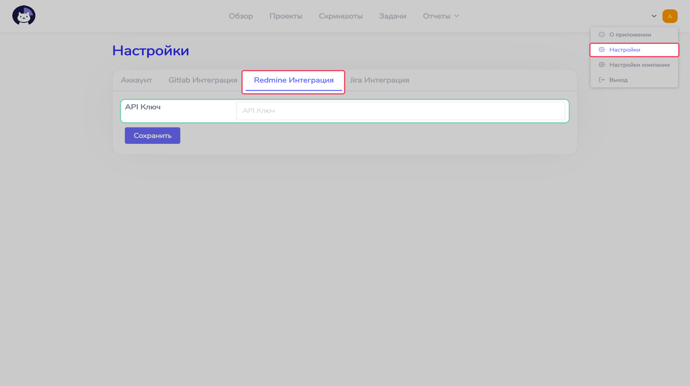
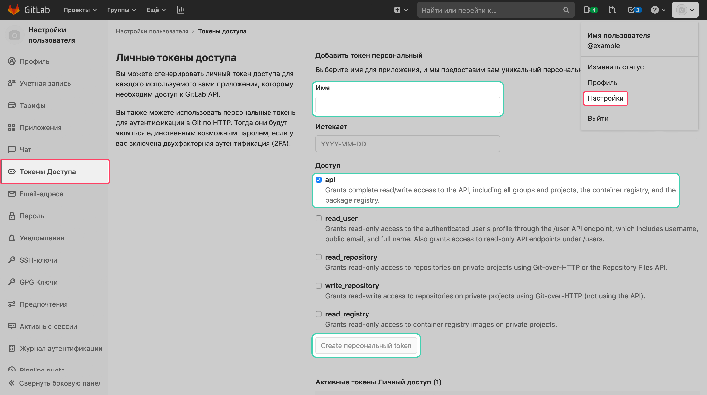
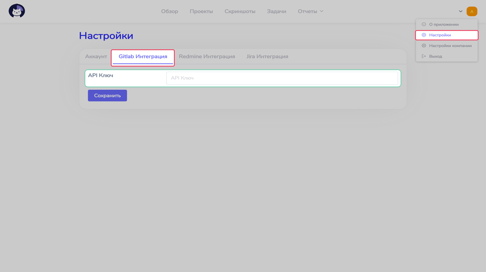

# Интеграции  :id=intro

Интеграции Cattr расширяют его возможности, позволяет автоматизировать работу с ним и встроить сервис в уже существующие рабочие процессы.

## Redmine  :id=redmine

Интеграция с системой управления проектов Redmine позволяет синхронизировать задачи и проекты, созданные в ней и в Cattr.

### Глобальные настройки  :id=redmine-global

Чтобы включить или отключить возможность синхронизации с Redmine, необходимо изменить параметр на странице `Настройки организации` в разделе `Общее`.

После включения интеграции появится дополнительная вкладка на странице `Настройки организации` под названием `Redmine`, позволяющая задать необходимые настройки.

_TODO ОПИСАНИЕ НАСТРОЕК_

### Настройки для пользователя  :id=redmine-personal

Если синхронизация включена для компании, то каждый пользователь должен задать персональный ключ, который будет использовать Cattr. Ключ можно получить на странице `Моя учетная запись`. 

Полученный ключ необходимо вставить в соответствующее поле на странице `Настройки` в разделе `Redmine Integration`.

### Задачу в Redmine создал, а в Cattr ее нет  :id=redmine-sync

Cattr опрашивает систему управления проектов с определенными интервалами, потому информация обновляется не сразу.

- Задачи синхронизируются каждую __1 минуту__
- Проекты синхронизируются каждые __5 минут__
- Пользователи синхронизируются каждые __5 минут__
- Потраченное время синхронизируется каждые __5 минут__
- Приоритеты синхронизируются каждые __15 минут__

### Задачу в Cattr удалил, а в Redmine осталась  :id=redmine-delete

Интеграция Cattr не удаляет задачи из системы управления проектов. Для удаления задачи во внешней системе необходимо удалить ее вручную.

## Gitlab  :id=gitlab

Интеграция с инструментом жизненного цикла Gitlab позволяет синхронизировать в одностороннем порядке задачи и проекты, созданные в ней и в Cattr.

### Глобальные настройки  :id=gitlab-global

Чтобы включить или отключить возможность синхронизации с Gitlab, необходимо изменить параметр на странице `Настройки организации` в разделе `Общее`.

Для работы интеграции необходимо задать адрес Gitlab на странице `Настройки организации` в разделе `Gitlab`.

### Настройки для пользователя  :id=gitlab-personal

Если синхронизация включена для компании, то каждый пользователь должен задать персональный ключ, который будет использовать Cattr. Ключ можно получить на странице `Моя учетная запись`. 

Полученный ключ необходимо вставить в соответствующее поле на странице `Настройки` в разделе `Gitlab Integration`.

### Создал задачу в Cattr, а в Gitlab она не появилась  :id=gitlab-create

Cattr синхронизируется с Gitlab в одностороннем порядке. Это значит, что изменения, которые вносятся в Cattr не отправляются в инструмент жизненного цикла. Любые изменения необходимо вносить вручную в Gitlab.
