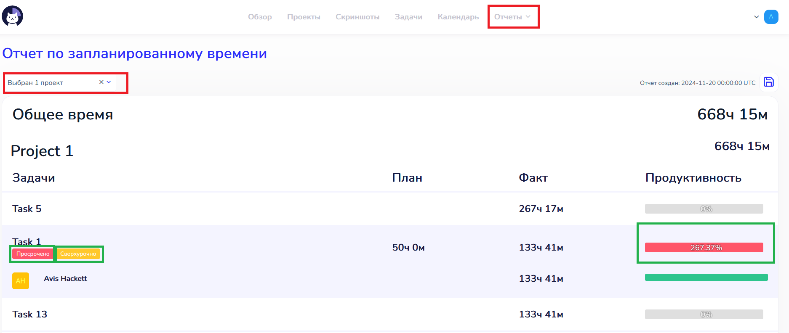
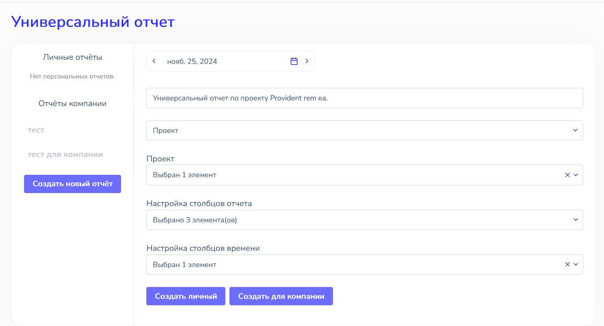
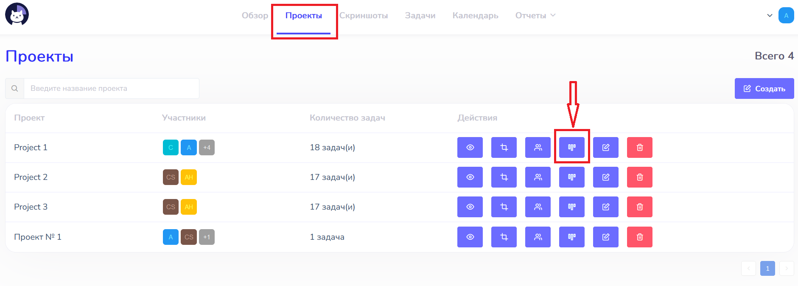
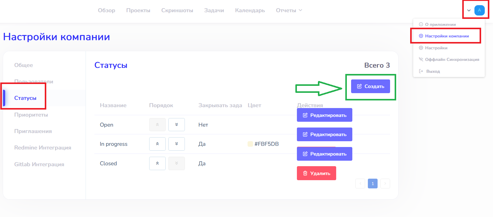
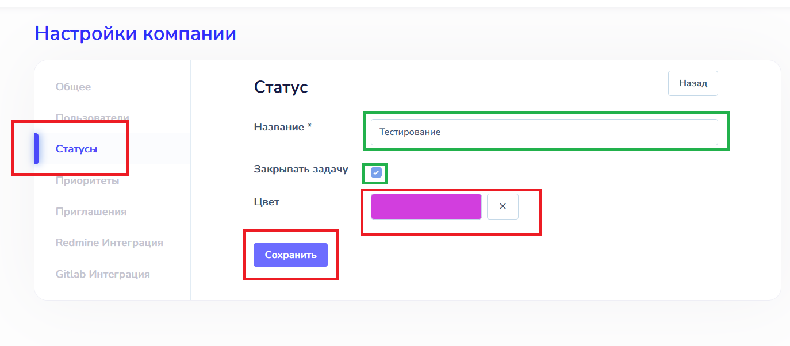

# Отчеты  :id=intro :priority=7

Cattr позволяет формировать различные виды отчетов для контроля затраченного времени

## Кто работает в настоящий момент  :id=online

Для проверки текущей активности можно использовать Командный обзор. Его можно открыть, зайдя в раздел `Обзор` и перейдя в раздел `Командный`.

!> Для доступа к этой функции необходимы роли `manager` или `auditor`

При выборе необходимых пользователей из раздела `Активные` можно посмотреть текущую ситуацию. 

## Активность сотрудника :id=activity
Узнать об активности сотрудника в течение того или иного промежутка времени можно зайдя в раздел `Скриншоты`. По специальной полоске под скриншотами, которая показывает общую активность сотрудника, можно сделать вывод о том, насколько активно работал сотрудник.

?> Оценка общей активности строится на соотношении кликов мыши и нажатий клавиш сотрудником.

## Временные затраты на проекты  :id=project

Узнать временные затраты на проекты можно в разделе `Отчет по проектам`. Он находится во вкладке `Отчеты`.

!> Данная функция доступна всем пользователям, однако просматривать отчеты, включающие других пользователей, могут только пользователи с ролями `manager` или `auditor`

Возможно задать фильтры по дате (промежутку между датами), пользователям и проектам. При клике на имя пользователя под проектам разворачивается список задач с указанием затраченного на них времени. При клике на имя задачи, а затем выбора интересующей даты отображаются сделанные во время работы над задачей скриншоты. Под ними находится шкала активности сотрудника в данный промежуток времени.

?> Скриншоты расположены в виде 10 минутных интервалов времени. В каждой строке по 6 таких скриншотов, таким образом каждая строка показывает статистику за час рабочего времени.

По степени заполненности шкалы прогресса можно узнать вклад того или иного пользователя; задачи в подсчет времени.

?> Отчет можно сохранить на компьютере в необходимом формате

## Отчет по использованию времени  :id=use

Рассчитать количество времени, отработанное пользователем в определенный интервал, можно с помощью раздела `Отчет по использованию времени`. Он находится во вкладке `Отчеты`.

!> Данная функция доступна всем пользователям, однако просматривать отчеты, включающие других пользователей, могут только пользователи с ролями `manager` или `auditor`

При выборе определенного пользователя можно просмотреть задачи (и проекты, которым они принадлежат), над которыми он работал и соотношение потраченного на них времени.

## Отчет по запланированному времени  :id=planned

Данный отчёт рассчитывается один раз в сутки на 00:00:00 выбранной даты в часовой зоне компании. Он показывает запланированное и отработанное время конкретных сотрудников на выбранных проектах и задачах, а также продуктивность выполнения задачи, рассчитанную как отношение отработанного времени к запланированному. Задачи в отчете отсортированы по проектам и внутри них - по фактическому времени работы над задачами по убыванию. Один клик мыши (в десктопной версии) или тап (в мобильной версии) по задаче раскроет список исполнителей с указанием фактически отработанного над задачей времени. Продуктивность указана только для задачи и не отображается в списке ее исполнителей.

?> Задачи в отчете могут иметь красный тег “Просрочено” (если дата выполнения задачи больше, чем было запланировано) и оранжевый тег “Сверхурочно” (если время выполнения задачи больше, чем было запланировано). 

## Универсальный отчет  :id=universal

?> Этот тип отчета позволяет настроить конкретные поля и столбцы для быстрого доступа к нужным данным. Он может быть создан как для компании (в этом случае его могут сформировать все пользователи с соответствующим доступом), так и для конкретного пользователя. 

Данные могут быть отсортированы по: 
* проектам -  в отчете отображается общее время работы всех пользователей и время работы каждого пользователя по отдельности на выбранных проектах, задачи “вкладываются” в проект и раскрываются при клике на него;

* пользователям -  в отчете отображается общее время пользователя на выбранных проектах, проекты “вкладываются” в пользователя и раскрываются при клике на него;

 * задачам -  в отчете отображается общее время работы всех пользователей и время работы каждого пользователя по отдельности на выбранных задачах, пользователи “вкладываются” в задачи и раскрываются при клике на них.

 Пример создания универсального отчета по проекту: выберите нужные вам параметры отчета, нажмите  `Сохранить`, затем `Сформировать`.

 
 
Также этот тип отчета включает в себя графики, они отображаются на фронтенде при формировании отчета, а также при скачивании отчета в формате Excel.

## Диаграмма Ганта  :id=gant

Для просмотра проекта в виде диаграммы Ганта зайдите в пункт меню `Проекты` и в списке проектов выберите соответствующую опцию:

?> Диаграмма Ганта — это инструмент визуализации проекта, который показывает его как последовательность связанных между собой задач во времени. Это график-таблица, в котором на вертикальной оси размещен список задач, на горизонтальной - временная шкала, на которой отмечены стадии и задачи проекта. При наведении на задачу появляется всплывающее окно с общей информацией о ней. 

Красная вертикальная полоса отмечает сегодняшнюю дату.  До красной черты находятся задачи, у которых запланированная дата завершения уже прошла. Если задача просрочена (завершена позже, чем запланировано), то внутри задачи будет указано значение  продуктивности, рассчитанней как отношение отработанного времени к запланированному (если оно больше 100, то задача просрочена).

## Канбан  :id=kanban

Для просмотра проекта в на доске канбан зайдите в пункт меню `Проекты` и в списке проектов выберите соответствующую опцию:

?> Доска канбан - это инструмент визуализации проекта, который показывает проект в виде нескольких  колонок (соответствующим стадиям работы над задачами, например, колонки “Сделать”, “В работе” и “Завершено). 

Каждая колонка - это статус, установленный администратором в разделе Статусы в Настройках компании:

При создании Статуса (колонки канбана) нужно указать его название, цвет фона заголовка колонки и, при помощи чекбокса “Закрывать задачу” -  должна ли задача быть закрыта после получения данного статуса (перемещения в данную колонку канбана).

Каждая задача оформлена в виде карточки, которая в процессе работы перемещается между колонками в соответствии с ее стадией.

При клике/тапе на карточку задачи появляется окно, содержащее основную информацию о задаче и кнопки для просмотра, редактирования или удаления задачи. Чтобы в мобильной версии переместить карточку задачи в другую колонку, зажмите фиолетовый круг в нижней части карточки и тяните его в нужную вам колонку.

## Календарь  :id=calender

На вкладке `Календарь` отображаются задачи выбранного месяца в виде планера. 

Задачи, которые на 00:00:00 сегодняшнего дня (в часовой зоне компании) имеют красный тег "Просрочено” (если дата выполнения задачи больше, чем было запланировано) и/или оранжевый тег “Сверхурочно” (если время выполнения задачи больше, чем было запланировано - см. «[Запланированное время](/ru/reports/?id=planned)»), имеют соответсвующие цветовые индикаторы в Календаре.

При наведении на задачу появляется всплывающее окно с общей информацией по задаче, а также, для отдельных задач и исполнителей, **Прогноз даты завершения задачи**. Он позволяет с учетом личной эффективности исполнителя/исполнителей задачи спрогнозировать фактические сроки её выполнения.

Прогноз даты завершения рассчитывается следующим образом:

* если исполнитель не назначен, либо работа над задачей не завершена, либо исполнитель еще не выполнил ни одной задачи в последние 2 месяца, то прогноз даты завершения не рассчитывается.

* если у задачи один исполнитель, то берется **коэффициент эффективности сотрудника** (далее КЭС) за 2 последних месяца и умножается на время запланированное. Пример: КЭС сотрудника 1,5, время выполнения задачи запланированное 10 часов. Прогноз даты завершения 1,5*10=15 часов. 
 
* если задачу делает несколько пользователей, то берется среднее арифметическое между их КЭС.

?> КЭС для всех сотрудников пересчитывается раз в день по крону. Отображаемые данные актуальны на 00:00:00 сегодняшнего дня (в часовой зоне компании).

**КЭС - это отношение фактического времени выполнения задачи к запланированному.**
Если сотрудник уже выполнял задачу в последние два месяца, то его КЭС = сумма КЭС всех его задач за 2 последних месяца/количество задач за 2 последних месяца.

?> Пример:
Пользователь за последние 2 месяца выполнил 3 задачи: одну за 150 часов при оценке в 50 часов (КЭС =3), вторую за 100 часов при оценке 80 часов (КЭС = 1,25) и третью за 2 часа при оценке в 20 часов (КЭС=0,2). КЭС Пользователя = (3+1,25+0,2)/3=1,48.

!> Важно! В расчете Прогноза даты завершения участвуют актуальные исполнители задачи. Если пользователь был удален из списка исполнителей, то его КЭС не учитывается. 

