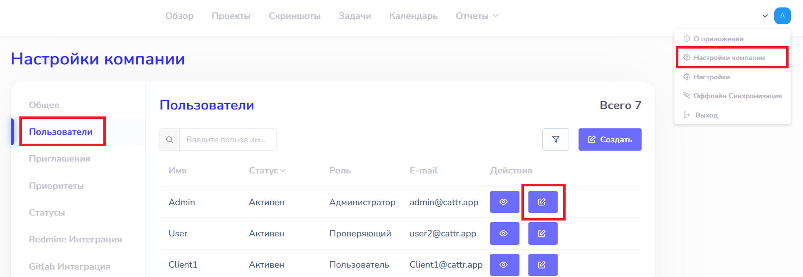

# Права доступа  :id=intro :priority=7

!> Для работы с пользователями компании и их доступом у вашего аккаунта должна быть роль `root`

Доступ пользователей к тем или иным разделам Cattr регулируется путем назначения и снятия ролей.

## Существующие роли  :id=existing

В настоящий момент существуют следующие роли:
- `root` - Имеет доступ ко всем разделам
- `manager` - Имеет полный доступ к задачам, проектам, скриншотам и к просмотру активности всех пользователей
- `auditor` - Имеет доступ на чтение ко всем проектам, создание и чтение всех задач, просмотр активности всех пользователей
- `user` - Имеет доступ на чтение к проектам, над которыми работает, создание и просмотр своих задач, просмотр личной активности

Первый пользователь, созданный в системе с помощью установщика, имеет роль `root`.

## Назначение ролей  :id=promote

Роль может быть назначена пользователю как для организации, так и для конкретного проекта. Для изменения текущих ролей пользователя необходимо зайти на страницу `Настройки компании` в раздел `Пользователи` и выбрать пользователя, подлежащего изменению.

Для назначения роли пользователю на конкретном проекте необходимо выбрать этот проект в выпадающем меню (можно начать вводить символы для поиска) и требуемую роль.

## Ручное добавление времени  :id=manual-time

Клиент Cattr сам отправляет информацию о рабочем времени сотрудника, но бывают случаи, когда может потребоваться ручное добавление времени.

?> Как работать с ручным добавлением времени, можно прочитать в разделе [Ручная установка интервалов](ru/workflow/?id=manual-time)

Для включения или отключения для пользователя возможности добавлять время, необходимо зайти на страницу `Настройки компании` в раздел `Пользователи` и выбрать пользователя, подлежащего изменению.

Для включения возможности добавлять время вручную у пользователя необходимо поставить соответствующую настройку в профиле.

 
