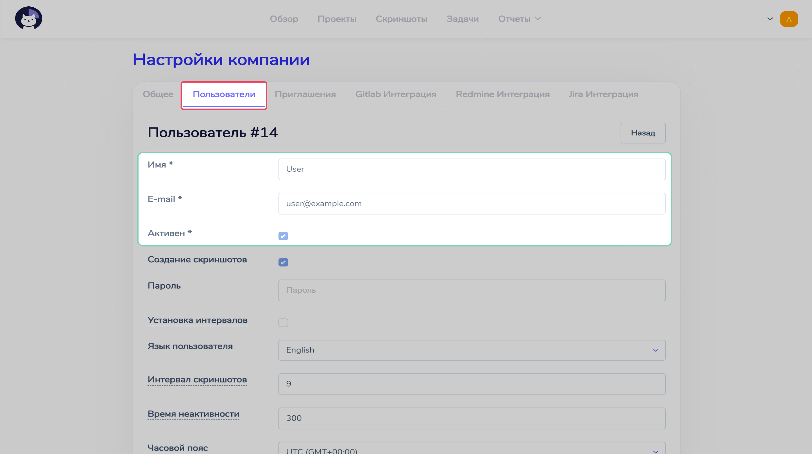

# Пользователи  :id=intro :priority=7

!> Для работы с пользователями компании у вашего аккаунта должна быть роль `root`

Каждый пользователь может самостоятельно сменить свою почту, отображаемое имя, пароль и язык, на котором будет отображаться панель управления на странице `Настройки`.

Список пользователей можно посмотреть на странице `Настройки компании` в разделе `Пользователи`.

## Создание пользователя  :id=create

Создать нового пользователя можно на странице `Настройки компании` в разделе `Пользователи`.

Задав необходимые параметры (имя пользователя, почта), подтвердить создание кнопкой `Сохранить`.

---

- `Роль по умолчанию` отвечает за то, какая роль будет у пользователя в организации
- `Интервал скриншотов` определяет количество минут, которое должно пройти прежде, чем клиентское приложение сделает новый снимок экрана
- `Время неактивности` - количество минут, в течении которого клиентское приложение не будет останавливать таймер, если обнаружит неактивность пользователя (отсутствие ввода с клавиатуры, движений мышки)
- `Часовой пояс` определяет временную зону, в которой работает пользователь
- Про параметр `Установка интервалов` можно прочитать в статье [Ручное добавление времени](ru/roles/?id=manual-time)

?> Подробнее о ролях пользователя можно прочитать в разделе [Система ролей](ru/roles/)

## Приглашение пользователя  :id=invite

Вы можете пригласить пользователя, отправив ссылку на его почтовый адрес, с помощью которой он сможет зарегистрироваться самостоятельно.

## Сброс пароля  :id=reset

Если пользователь забыл пароль, то на странице входа можно воспользоваться функцией сброса пароля.

На открывшейся странице необходимо будет ввести почту пользователя, пароль которого необходимо сбросить.

После ввода на почту пользователя придет ссылка, после перехода по которой пользователю будет предложено ввести новый пароль.

## Часовой пояс  :id=timezone

Часовой пояс можно задавать как для компании, так и для пользователя. В часовом поясе компании генерируются и отображаются отчеты, и он считается часовым поясом для пользователей, у которых он не задан специально.

Если часовой пояс задается для пользователя, то при учете его времени в отчетах будет внесена поправка на разницу часовых поясов пользователя и компании.
