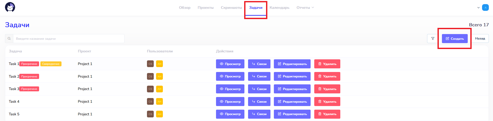
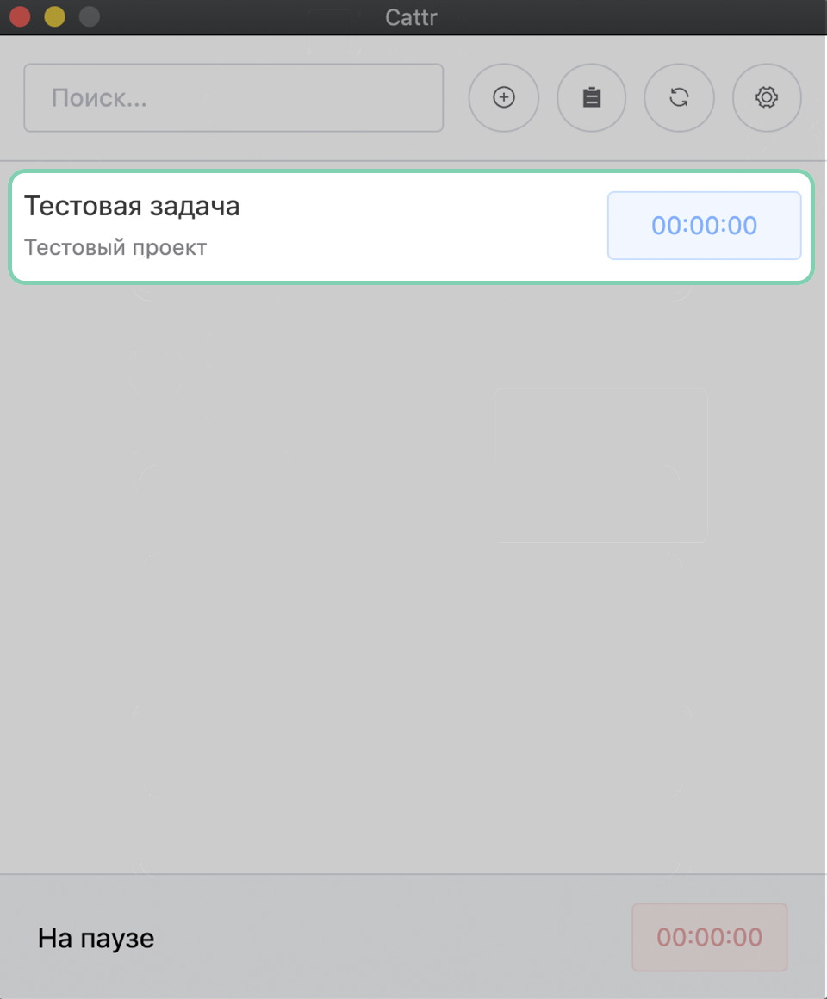
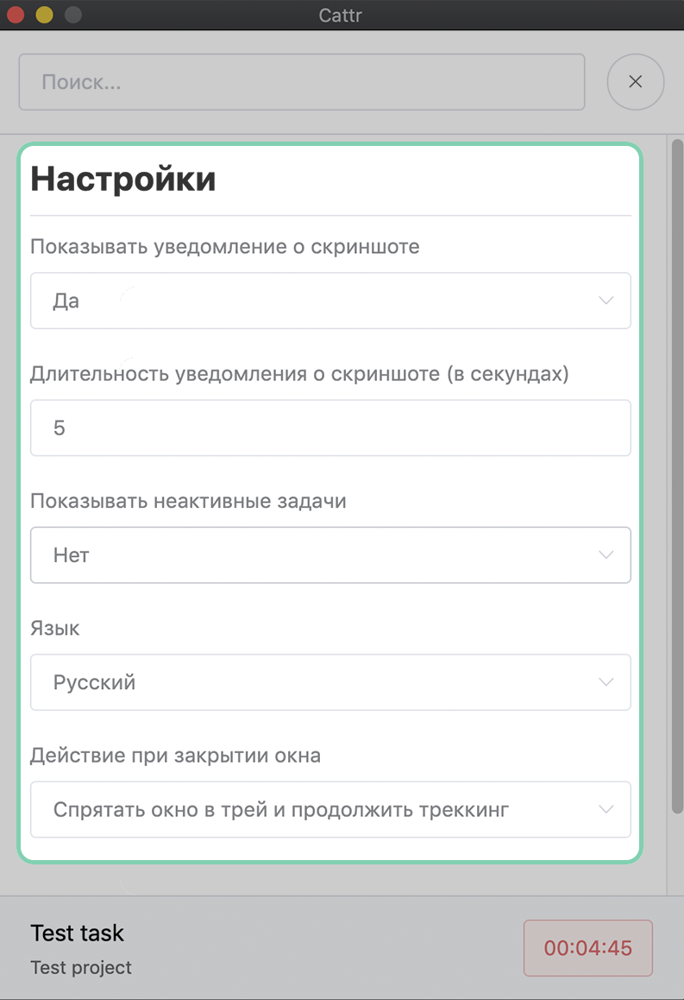
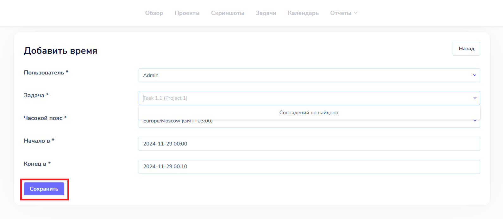
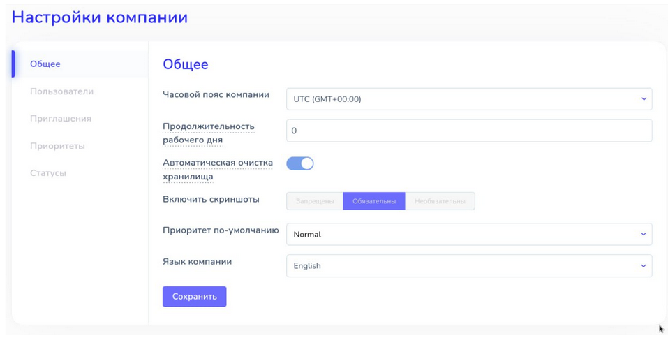
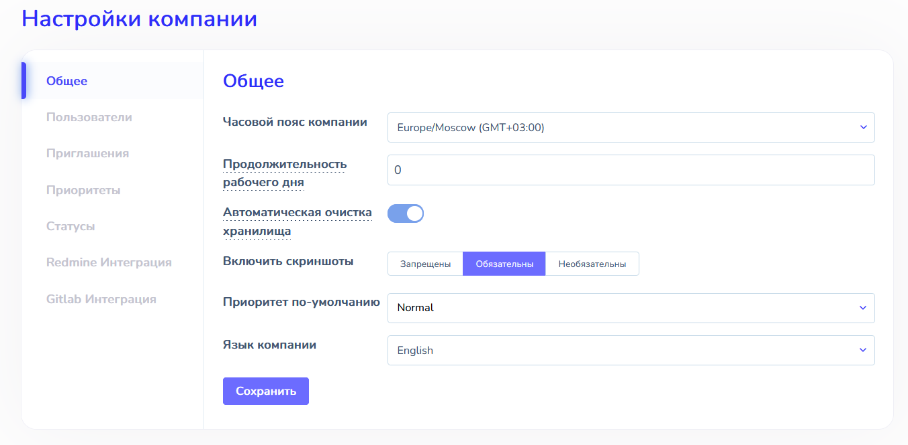

# Рабочий процесс  :id=intro :priority=7

Повседневную работу с Cattr можно разбить на несколько основных этапов, которые описаны ниже.

## Создание проекта  :id=project

Задачи группируются в проекты, что упрощает работу с доступом и отчетностью по ним.

!> Проекты могут создавать только пользователи с ролью `manager`

Для создания нового проекта необходимо перейти в раздел `Проекты` и выбрать пункт `Создать`.

Задав параметры проекта (название, описание), подтвердить создание кнопкой `Сохранить`.

?> Параметр `Важно` отвечает за то, будут ли сохраняться снимки экрана, принадлежащие проекту, при очистке хранилища из-за нехватки места на диске сервера

?> Проект может делиться на стадии, в которые будут входить отдельные задачи. Сроки выполнения стадий будут равны временным рамкам входящих в них задач и будут отображаться в таблице Ганта. 

После создания проекта можно добавлять к нему задачи и назначать их исполнителей.

?> Как назначать менеджеров проекта, которые смогут добавлять новые задачи можно прочитать в разделе [Система ролей](ru/roles/?id=promote)

## Создание задачи  :id=task

Проект состоит из задач, к которым привязаны временные интервалы.

!> Задачи могут создавать только пользователи с ролями `manager` или `auditor`

Для создания нового проекта необходимо перейти в раздел `Задачи` и выбрать пункт `Создать`.

Для создания задачи необходимо выбрать из выпадающего меню проект и стадию, к которым она относится (по мере набора символов в поле ввода будет производиться поиск и предлагаться найденные проекты). Далее нужно задать параметры задачи (название, описание, вложенные файлы, приоритет, исполнителей, планируемое время выполнения, а также дату начала и завершения работы над задачей). После ввода данных нажать кнопку  `Сохранить`.

После создания задачи можно связать ее с другими задачами проекта при помощи соответствующей функции на странице со списком задач. Задача может быть родительской (тип связи “Предшествует”) и дочерней (тип связи “Следует”). Дата начала дочерней задачи смещается, если дата завершения родительской задачи смещается на более поздний срок. Таким образом, при задержке в выполнении задач можно будет увидеть визуализацию сроков завершения проекта и его этапов в диаграмме Ганта.

?> Параметр `Важно` отвечает за то, будут ли сохраняться снимки экрана, принадлежащие задаче, при очистке хранилища из-за нехватки места на диске сервера

После добавления задачи назначенный пользователь сможет учитывать потраченное на нее рабочее время.

?> Можно автоматически создавать проекты и задачи, подключив к Cattr одну из [интеграций](ru/integrations/)

## Клиентское приложение  :id=tracker

Для авторизации в приложении необходимо использовать адрес, на котором находится Cattr и связку почта-пароль пользователя.

После авторизации будет выведен список задач, которые назначены данному пользователю, а также время, отработанное за текущий день.

При клике на название задачи можно посмотреть ее описание. Для начала учёта рабочего времени необходимо активировать отсчет, кликнув на время рядом с задачей. Остановить таймер можно, нажав на общий счетчик времени (внизу) или на счетчик времени рядом с конкретной задачей.

В конце рабочего дня пользователю доступна возможность сформировать отчет о проделанной работе. В буфер обмена будет скопирована информация о названии проектов и задач, над которыми работал пользователь. Можно выбрать копирование без специального оформления (Обычным текстом) или с разметкой Markdown.

Также пользователю доступна настройка следующих параметров клиента:
- Показ уведомления о скриншоте
- Длительность уведомления
- Показ активных задач
- Смена языка
- Поведение клиента при закрытии окна

Пользователь также может выбрать, хочет ли он отправлять статистику использования и отчеты об ошибках разработчикам Cattr.

## Ручная установка интервалов  :id=manual-time

Пользователи могут добавлять потраченное время не только с помощью клиентских приложений, но и с помощью панели управления.

!> По умолчанию пользователи не могут добавлять время вручную, подробности можно прочитать в разделе [Права доступа](ru/roles/?id=manual-time)

Для добавления потраченного времени необходимо перейти на страницу `Обзор` и выбрать пункт `Добавить время`.

Выбрав пользователя, задачу и временные границы интервала, подтвердить создание кнопкой `Сохранить`. Поиск задачи также может осуществляться по названию проекта, достаточно ввести название и в выпадающем списке Вы увидите все задачи, относящиеся к этому проекту.

?> Временные интервалы, созданные таким способом, будут показываться другим цветом на странице `Обзор` в разделах `Личный` и `Командный`
 

## Отключение скриншотов  :id=screenshots

Глобальный селектор теперь может быть задан не только в настройках, но и в переменных окружения. Пример доступных переменных окружения можно посмотреть в файле .env.example, а установить значение можно в зависимости от варианта установки, либо в файле .env, либо в переменные окружения docker контейнера. Если он задан в переменных окружения, то в интерфейсе он недоступен для изменения (значение показывается, но поменять его не может даже администратор).

 

Если он выключен, то:
- удалена ссылка на раздел “Screenshots” в верхнем меню,
- при клике на рабочее время в дашборде скриншот перестает всплывать над интервалом,
- в Project report вместо разворачивающегося списка скриншотов напротив даты мы видим обычный список “дата-время”.

Настройки отключения скриншотов для роли администратора отображаются следующим образом:

- если на глобальном уровне задана настройка скриншотов “Обязательны”, администратор видит неактивный селектор,
- если на глобальном уровне задана настройка скриншотов  “Необязательны”, администратор может сделать их обязательными для пользователя или отключить принудительно для пользователя.
- если на глобальном уровне задана настройка скриншотов  "Запрещены", администратор видит неактивный селектор, в котором написано “отключено”, и скриншоты для всей компании запрещены.

 

Настройки отключения скриншотов для роли Пользователя отображаются по аналогии, но у пользователя нет варианта “Необязательны”, и он наследует настройки администратора и глобальные настройки.

?> Данный функционал разработан при поддержке Федерального государственного бюджетного учреждениея «Фонд содействия развитию малых форм предприятий в научно-технической сфере» в рамках федерального проекта «Цифровые технологии». 

